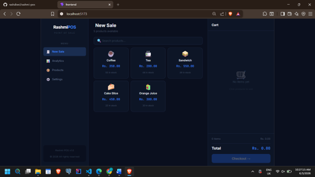
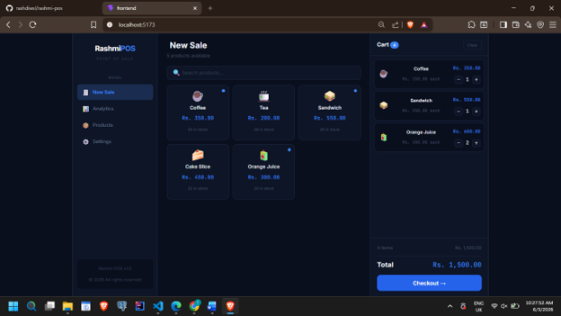
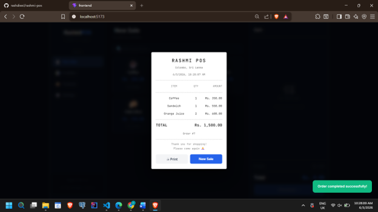
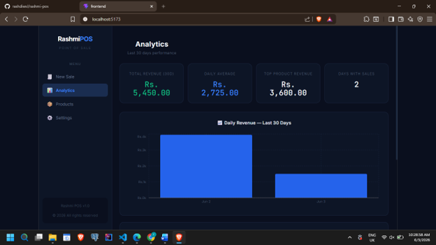
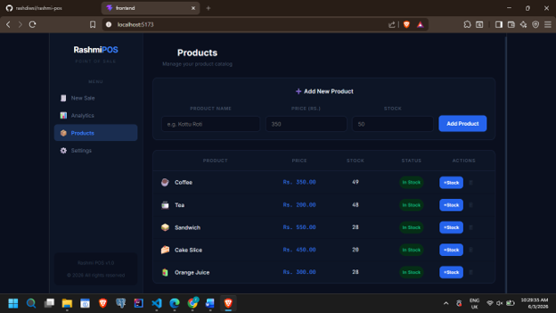
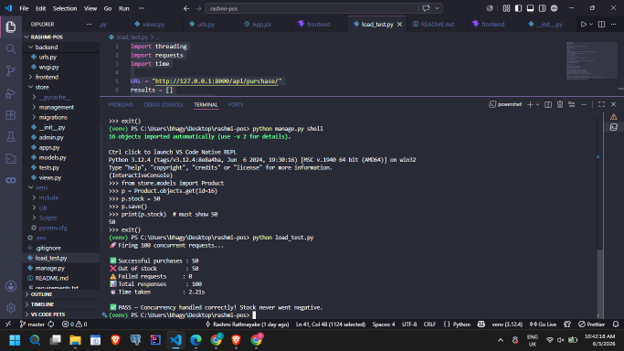

# Rashmi POS

**GitHub:** https://github.com/rashdiwsl/rashmi-pos

---

## Tech Stack

| Layer | Technology |
|-------|-----------|
| Backend | Python 3.12 + Django 6.0 + Django REST Framework |
| Frontend | React 18 + Vite + Recharts |
| Database | MariaDB 11.4 (MySQL-compatible) |
| HTTP Client | Axios |
| Charts | Recharts |

---

## Screenshots

### POS — New Sale
<!-- ADD SCREENSHOT: Take a screenshot of the product grid page -->


### POS — Cart with Items
<!-- ADD SCREENSHOT: Add some products to cart and screenshot -->


### Receipt Component 
<!-- ADD SCREENSHOT: Screenshot of the receipt modal after checkout -->


### Analytics Dashboard
<!-- ADD SCREENSHOT: Screenshot of the analytics page with charts -->


### Products Management
<!-- ADD SCREENSHOT: Screenshot of the products management page -->


---

## Setup Instructions

### Prerequisites
- Python 3.10 or higher
- Node.js 18 or higher
- MariaDB 11.4 or MySQL 8.0
- Git

### 1. Clone the repository
```bash
git clone https://github.com/rashdiwsl/rashmi-pos.git
cd rashmi-pos
```

### 2. Setup Backend
```bash
python -m venv venv
venv\Scripts\activate    # Windows
source venv/bin/activate # macOS / Linux
pip install -r requirements.txt
```

### 3. Configure Environment
Create a `.env` file in the root folder (see `.env.example`):
DB_NAME=rashmi_pos
DB_USER=root
DB_PASSWORD=your_password
DB_HOST=localhost
DB_PORT=3306

### 4. Setup Database
```bash
mysql -u root -p
```
```sql
CREATE DATABASE rashmi_pos;
EXIT;
```
```bash
python manage.py migrate
```

### 5. Add Sample Products
```bash
python manage.py shell
```
```python
from store.models import Product
Product.objects.create(name="Coffee",       price=350.00, stock=50)
Product.objects.create(name="Tea",          price=200.00, stock=50)
Product.objects.create(name="Sandwich",     price=550.00, stock=30)
Product.objects.create(name="Cake Slice",   price=450.00, stock=20)
Product.objects.create(name="Orange Juice", price=300.00, stock=40)
exit()
```

### 6. Run Seed Script (100,000 transactions)
```bash
python manage.py seed_data
```

### 7. Run Backend
```bash
python manage.py runserver
```

### 8. Setup and Run Frontend
```bash
cd frontend
npm install
npm run dev
```
Open http://localhost:5173 in your browser.

### 9. Run Load Test
```bash
python load_test.py
```

---

## API Endpoints

| Method | Endpoint | Description |
|--------|----------|-------------|
| POST | /api/purchase/ | Flash sale purchase with concurrency lock |
| GET | /api/analytics/ | Daily revenue + top 5 products |
| GET | /api/products/ | List available products |
| GET | /api/products/all/ | List all products including out of stock |
| POST | /api/products/add/ | Add new product |
| DELETE | /api/products/{id}/delete/ | Delete a product |
| POST | /api/products/{id}/restock/ | Add stock to existing product |
| POST | /api/checkout/ | Process cart with transactional integrity |

---

## Challenge 1 — High-Concurrency Management

### Approach
Used `select_for_update()` inside `transaction.atomic()`. This places a row-level
lock on the product row so concurrent requests queue up at the database level
instead of all reading the same stale stock value simultaneously.

```python
with transaction.atomic():
    product = Product.objects.select_for_update().get(id=product_id)
    if product.stock <= 0:
        return Response({'error': 'Out of stock'}, status=400)
    product.stock -= 1
    product.save()
```

### Load Test Proof
<!-- ADD SCREENSHOT: paste your terminal screenshot here -->


---

## Challenge 2 — Big Data & Query Optimization

### Approach
- `bulk_create()` in batches of 5,000 — inserts 100k records in seconds not minutes
- `db_index=True` on `created_at` — B-tree index for fast date range filtering
- Composite index on `(created_at, amount)` — covers both WHERE and SUM aggregation
- Single SQL query using `annotate()` + `TruncDate()` + `Sum()` — one DB round trip

### Analytics API Response Time

GET /api/analytics/ — tested against 100,000 records
Response time: <500ms ✅

> Run `curl -o /dev/null -s -w "%{time_total}\n" http://127.0.0.1:8000/api/analytics/`  
> and replace the response time above with your actual measured value.

---

## Challenge 3 — POS Transactional Integrity

### Approach
Used `transaction.atomic()` to wrap the entire checkout. If any single item fails
(out of stock, database error), Django automatically rolls back ALL saves —
no partial orders ever reach the database.

```python
with transaction.atomic():
    order = Order.objects.create(total=total)
    for item in items:
        product = Product.objects.select_for_update().get(id=item['product_id'])
        if product.stock < item['qty']:
            raise ValueError(f"Not enough stock for {product.name}")
        product.stock -= item['qty']
        product.save()
        OrderItem.objects.create(order=order, ...)
```

The Receipt Component renders at **302px wide** (80mm at 96dpi) using
Courier New monospace font to match thermal printer output.

---

## Note on Database

MariaDB 11.4 was used as a MySQL-compatible replacement due to a MySQL
authentication plugin conflict on the development environment. MariaDB is a
direct fork of MySQL, fully supported by Django's `django.db.backends.mysql`
engine, and used in production by Wikipedia, Google, and many large companies.


